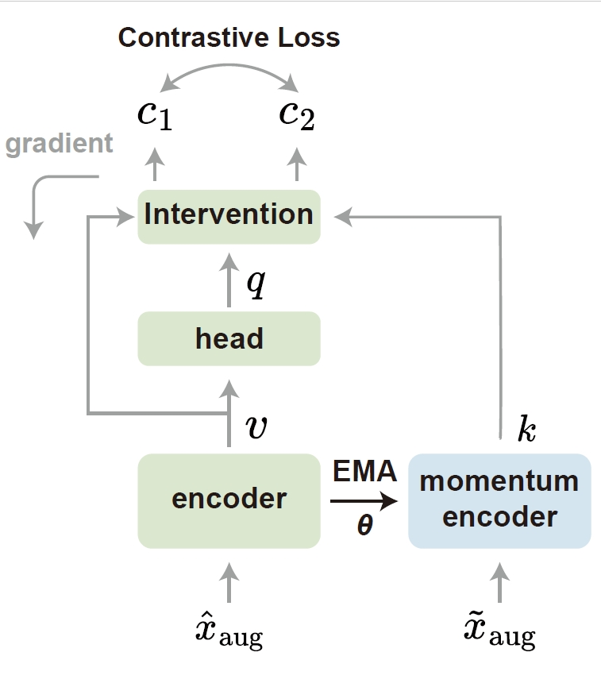
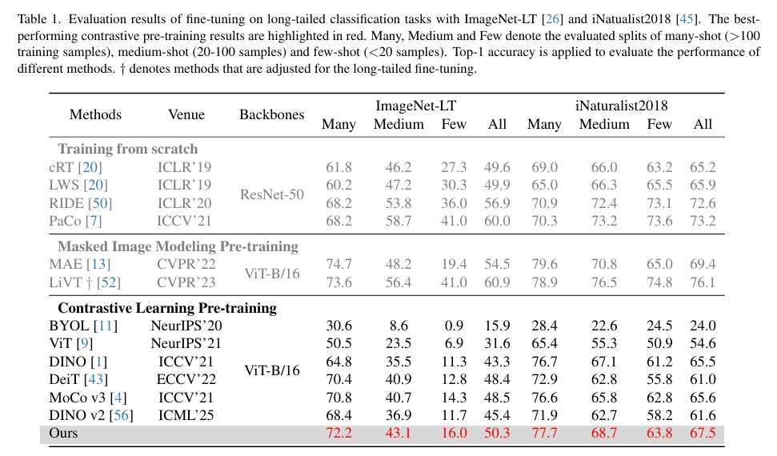
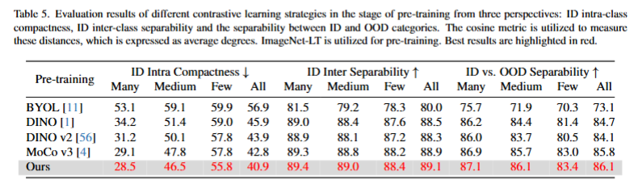

# ResilientCL

This repository is a PyTorch implementation of resilient contrastive learning proposed in *Resilient Contrastive Pre-training under Non-Stationary Drift* (submitted)

-----------------------------

The remarkable success of large-scale contrastive pre-training has been largely driven by by vast yet static datasets. However, as the scaling paradigm evolves, this paradigm encounters a fundamental challenge when applied to dynamic data streams characterized by concept drift—unpredictable changes in the underlying data distribution. This paper aims to advance robust pre-training under such non-stationary environments. We begin by revealing that conventional contrastive pre-training methods are highly susceptible to concept drift, resulting in significant substantial bias and instability within the learned feature representations. To systematically analyze these effects, we develop a structural causal model that elucidates how drift acts as a confounder, distorting the learned representations. Based on these causal insights, we propose **R**esilient **C**ontrastive **P**re-training (RCP), a novel method that incorporates causal intervention. RCP formulates a causally-informed objective to mitigate drift-induced biases through targeted interventions. The method is designed for simple and scalable implementation and exhibits notable adaptability, promoting robust and autonomous pre-training on non-stationary data. Comprehensive experiments across various downstream tasks consistently demonstrate that RCP effectively alleviates the detrimental impact of concept drift, yielding more resilient and generalizable representations. 

The code in this repo is copied/modified from [MAE](https://github.com/facebookresearch/mae) and [MoCo v3](https://github.com/facebookresearch/moco-v3).




> The workflow of our causal contrastive pre-training under concept drift streaming. Within the data streaming, a large batch size is opted for a wider drift adaptation window sliding to adapt changes in data distribution. Undergoes various random augmentations, the transformed instances from the identical sample are feature-extracted by both the encoder and the momentum encoder to get the key and value, respectively. An MLP head is utilized to obtain the query of the encoder features. Subsequently, causal intervention is utilized to alleviate concept drift in the data stream within the adaptation window, resulting in the acquisition of two objects for contrastive learning.


## Pre-training

To pre-train ViT-Base, run the following on 2 GPUs each:

```bash
torchrun --nproc_per_node=2 main_pretrain.py \
    --model rescl_vit_base_patch16 \
    --accum_iter 2 \
    --batch_size 512 \
    --blr 1.5e-4 \
    --mask_ratio 0.25 \
    --epochs 800 \
    --moco-m-cos --moco-t=.2 --moco-dim=1024 \
    --warmup_epochs 40 \
    --weight_decay 0.05 \
    --num_workers 8 \
    --dataset imagenet-lt \
    --output_dir ./pretrain_vit_base_dir \
    --log_dir ./pretrain_vit_base_dir \
```

The detailed pre-training instruction is in [PRETRAIN.md](./PRETRAIN.md).

## Fine-tuning

To fine-tune our pre-trained ViT-Base with 2 GPUS, run the following command:

```bash
OMP_NUM_THREADS=1 torchrun --nproc_per_node=2 main_finetune.py \
    --accum_iter 4 \
    --batch_size 32 \
    --model vit_base_patch16 \
    --finetune ${PRETRAIN_CHKPT} \
    --epochs 100 \
    --blr 5e-4 --layer_decay 0.65 \
    --weight_decay 0.05 --drop_path 0.1 --mixup 0.8 --cutmix 1.0 --reprob 0.25 \
    --dist_eval --data_path ${IMAGENET_DIR}
```

The detailed fine-tuning instruction is in [FINETUNE.md](./FINETUNE.md).


## Results

we initially showcase the robust performance of our RCP in the downstream task of long-tailed classification under drift pre-training, with results of fine-tuning.



we compare mainstream contrastive pre-training methods, with the baseline of ViT, and our RCP exhibits superior results beyond other contrastive pre-training methods. Compared to other methods that employ the student-teacher paradigm, our RCP method demonstrates additional performance enhancements on both the Medium and Few splits, especially in the iNaturalist2018 dataset. It is demonstrated that the proposed causal interventional objective significantly alleviates the accumulated bias due to momentum updates of the teacher network. 


Besides, to validate the generalization capability of RCP under drifting scenarios, we conducted experiments from the perspectives of domain shift and out-of-distribution (OOD) detection.


 Following that, the feature embedding space of pre-trained models is intuitively visualized with degrees, illustrating how RCP mitigates the concept drift within the feature space.

 

